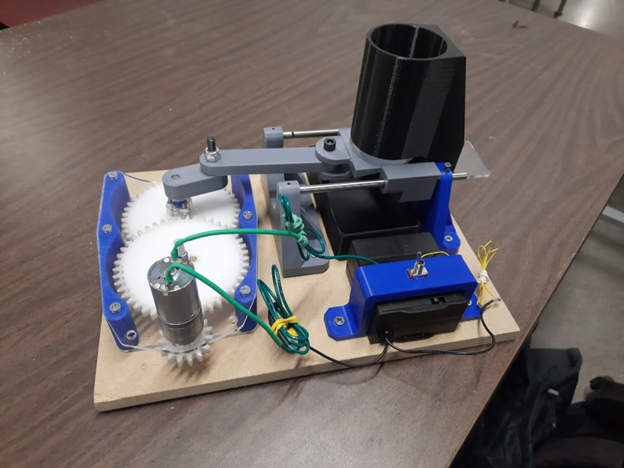

# ME 370 - Mechanical Design I at UIUC (Fall 2023)

## Introduction
This repository contains the CAD and analysis files for the **Motorized Vegetable Slicer** project completed during the ME 370 course at the University of Illinois Urbana-Champaign (UIUC).

## Features
- **Human-Centered Design:** Focused on the needs of elderly individuals with dexterity challenges, ensuring ease of use, accessibility, and safety.
- **Gearbox Design:** Used a 9:1 gear ratio to increase torque for easy cutting, with laser-cut Delrin plastic gears for strength, durability, and precision.
- **Crank-Slider Mechanism:** Employed a motor-driven crank-slider mechanism for efficient reciprocating motion of the blade.
- **Gravity Feeding Mechanism:** Enabled multiple cuts without manual input, with adjustable slice thickness based on the position of the blade.
- **Safety Features:** Incorporated protective covers for sharp components and a lightweight, compact construction for easy handling and safety.

## Authors
This project was designed and developed by:
- **Qingran WU**
- **Xuanyi JIN**
- **Kevin RIFE**
- **Margaret DOBSON**
